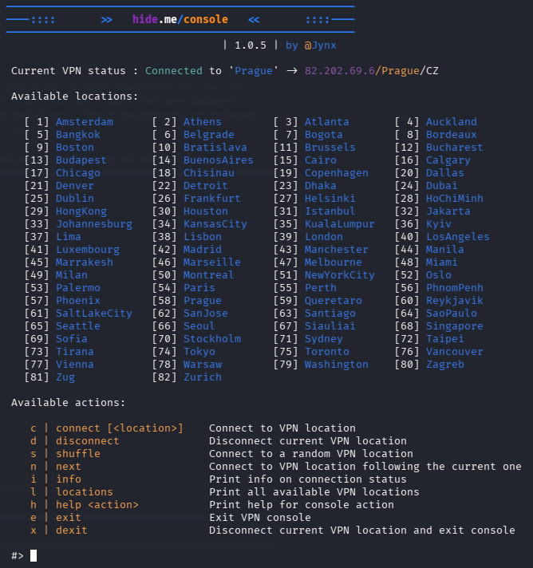
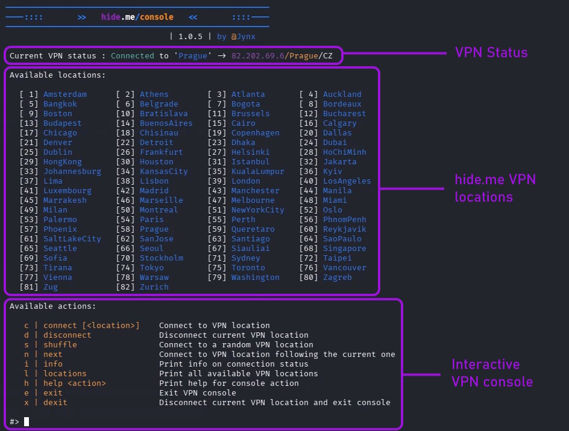

```
____     _     _     _                             __                       _          ____
\ \ \   | |   (_)   | |                           / /                      | |        / / /
 \ \ \  | |__  _  __| | ___   _ __ ___   ___     / /__ ___  _ __  ___  ___ | | ___   / / / 
  > > > | '_ \| |/ _` |/ _ \ | '_ ` _ \ / _ \   / / __/ _ \| '_ \/ __|/ _ \| |/ _ \ < < <  
 / / /  | | | | | (_| |  __/_| | | | | |  __/  / / (_| (_) | | | \__ \ (_) | |  __/  \ \ \ 
/_/_/   |_| |_|_|\__,_|\___(_)_| |_| |_|\___| /_/ \___\___/|_| |_|___/\___/|_|\___|   \_\_\
											             Version 1.0.5			 @Jynx                                                                 
```

# ## hide.me/console
**hide.me/console** is an interactive management console for the **hide.me VPN for Linux CLI**.

Implemented as a Bash script, it allows you to easily connect to and disconnect from VPN locations, get status overviews, and more. Available locations are fetched online from the official [hide.me website](https://hide.me/en/network), eliminating the need to store them in a local file.

Here's how it looks like...



## ## Features

- **Piece of cake:** Easy and intuitive to use (really).
- **I love to serve:** Automatically fetches available VPN locations online.
- **Catch me if you can:** Allows random selection of and switching between VPN locations ("shuffling").
- **Silence isn't golden:** Detailed status message on current VPN connection status, including WAN IP, region, and country information.
- **Helping hand:** Integrated help for all actions.
- **Soft landing:** Doesn't destroy your life in case you do something wrong or stupid, but helps you gracefully instead.

## ## What's new in Version 1.0.5?

Fueled by sleepless nights and way too much coffee, I spared no expense or effort to bring you the following changes:

* **Cool new action to play with:** The `locations` action has been added to the interactive console so you can fetch and view the full list of VPN locations at any time. Curious? Then check out the details in the main guide below.
* **Location name normalization, AKA grudgingly necessary bugfix:** VPN locations with weird special characters in their names—like "à", "ñ", or God knows what else (thanks a lot, France & Co.!)—are now automatically normalized because the hide.me service can't handle them. In other words: connecting to these locations is only possible if special characters are normalized, i.e. "à" becomes "a", "ñ" becomes "n", and so on. That’s exactly what happens now. Automatically. No voodoo required (anymore).
* **Removing zombie units, AKA grudgingly necessary bugfix, part 2:** If a connection to a VPN location fails (for instance, because its name wasn't normalized...), hide.me leaves behind a rather weird "zombie unit"" that serves no purpose whatsoever—other than blocking all future VPN connections. Only hide.me knows why that’s even a thing. In any case, the script now tries its absolute best to clean up those zombies.
* **Pleasing the customer (that's you!):** General error handling and console logging of the script was polished up a bit.

## ## Prerequisites

This script was developed using a paid hide.me account. While it _should_ work with the free tier (I guess), I cannot give you a 100% guarantee. So, if you run into any problems, feel free to [contact me](mailto:jynxified@proton.me) or [create an issue](https://github.com/jynxified/hide-me-console/issues).

In both cases (paid or free account) you need the following prerequisites:

* A current installation of the [hide.me VPN for Linux CLI](https://hide.me/en/software/linux).
* A hide.me access token on your system.

The latter is a breeze. In case you're using a **free account**, just do the following:

```bash
cd /opt/hide.me/
./hide.me token free-nl
```

For a **paid account** call:

```bash
cd /opt/hide.me/
./hide.me token nl
```

The value at the end does not strictly have to be `nl`. Any location supported by hide.me, as well as any hide.me server, will do the job. The only crucial requirement is that it _is_ a valid hide.me location or server (obviously).

You'll be asked for your account credentials in both cases, i.e. your hide.me username and password. Enter it and watch the magic happen.

If everything was successful, a file named `accessToken.txt` will be present in `/opt/hide.me/`. At this point, everything is set up and ready, and you can access hide.me VPN using the hide.me/console.

If you still run into any trouble, especially concerning the hide.me VPN for Linux CLI installation or the access token generation, please check the official [hide.me website](https://hide.me/en/) or try the [hide.me forum](https://community.hide.me/), that makes way more sense than just trusting my words ;).

## ## Installation

Clone the repository and navigate into the project directory:

```bash
git clone https://github.com/jynxified/hide-me-console.git
cd hide-me-console
```
Make the script executable:
```bash
chmod +x hide-me-console.sh
```

And ... that's it. Congratulations, you're now a proud owner of the hide.me/console!

## ## Starting

You can run the script as a regular user or using `sudo`. Using `sudo` prevents you from having to enter your password every time you connect to or disconnect from a VPN location as this job is done using `systemctl`.

```bash
./hide-me-console.sh
```

The script does not take any launch arguments; it doesn't need to. Everything related to hide.me is handled via inputs directly within the hide.me/console. It's an interactive tool, remember? (In case you don't remember, please skip back to the beginning of this document and start reading again.)

**Pro tip for particularly cool (or lazy) people**

Create an alias for the script in your `.bashrc` or `.zshrc` file—or whatever shell and Linux distribution you're a fan of and are using and however the corresponding rc file is named there. Such an alias makes your VPN-based life much easier and convenient.

```bash
alias vpn="<location_of_the_script>/hide-me-console.sh"
```

## ## Usage

The hide.me/console consists of three main areas:



### VPN status

The VPN status indicates whether a connection to a VPN is currently active. If connected, the status line starts with a green "**Connected**" indicator, confirming your connection is secured. It then displays your public IP (the "WAN IP") along with its corresponding region and country.

```
Connected to 'Oslo' -> 79.127.151.244/Oslo/NO
|_______|     |__|     |____________||___||__|
    |           |             |        |    |
   VPN         VPN         WAN IP   Region Country
indicator    location         
```

The status bar from this example indicates that a VPN connection to the "Oslo" location is currently active, and that your public IP address on the internet is 79.127.151.244, located in the "Oslo" region (big surprise!), in the country of "Norway" (abbreviated as "NO").

Or, to put it simply for people with no affinity for tech jargon: You are free to browse the internet safely and anonymously now. Woohoo!

In case no VPN connection is established, the status line starts with a red "**Unconnected**" indicator, confirming your connection is not secured, followed by your real WAN IP, region, and country (i.e. the IP you got from your ISP).

```
Not connected -> 12.34.567.890/Paris/FR
|___________|    |____________||___||__|
      |                 |        |    |
     VPN             WAN IP   Region Country
  indicator             
```

Again, to put it simply: You are not protected by a VPN and therefore you cannot browse the internet safely and anonymously, every site you visit can see who you really are. Darn!

### hide.me VPN locations

The VPN locations area lists all hide.me VPN locations available for connection. This list is fetched fresh from the official [hide.me website](https://hide.me/en/network) every time the hide.me/console is launched, ensuring it is as up-to-date as possible.

### Interactive VPN console

The interactive VPN console area is (finally) the part where things get interesting and particularly fancy. This is where you can establish hide.me VPN connections, disconnect active ones, or retrieve information about the current connection status by using console-like actions.

**| Establishing VPN connections |**

```
c | connect [<location>]
```

The connect action establishes a connection to a VPN. It can either be written out in full ("`connect`"), or, for lazy folks like myself, abbreviated as just "`c`". Both are equivalent.

Examples:

```
connect Amsterdam
```

The following convenience features are built-in:

* **Smooth switch:** If there's no active connection to a VPN location yet, the console will establish one. If, on the other hand, a VPN connection already exists, the console will switch from the current location to the newly specified one. This means there is no need for you to disconnect first—you can switch to another location seamlessly and without any hassle.
* **Index-based connect:** Instead of typing in the full name of a location, you can also just pass the index number of it from the displayed list (see "hide.me VPN locations" above) to `connect`.
* **Random connect:** If neither a location nor an index number is specified with `connect` (i.e. nothing at all), the console will connect to a location randomly selected from the full available list. If a VPN connection is currently active, `connect` ensures that the same location is not selected again, guaranteeing a completely new one.

**| Disconnecting VPN connections |**

```
d | disconnect
```

The disconnect action terminates a VPN connection if one is currently active. If none exists, it does... nothing. Except, of course, pointing out this interesting fact with a quite friendly note. And of course, here again, it can either be written out in full ("`disconnect`"), or abbreviated as just "`d`".

That's all it does. Really. No convenience features here.

**| VPN randomization |**

```
s | shuffle
```

The shuffle action works similarly to the connect action without a specified location. Well, okay, truth be told, it does _exactly_ the same: it picks a random VPN location from the full list and connects to it. If a connection is already active, it switches to the new one while ensuring it’s not the same location as before. If no connection exists yet, it establishes one.

Why does this action exist if it does the exact same thing as connect, you ask? Because I wanted to have one. Sue me!

Once again, this action can either be written out in full ("`shuffle`"), or abbreviated as just "`s`".

**| VPN round-robin |**

```
n | next
```

The next action establishes a connection to the VPN location that comes immediately _after_ the currently active one in the overall list. If no VPN connection exists yet, the action starts with the very first location on the list. If there is currently an active connection to the last location on the list, it jumps back to the beginning of the list. This allows you to perform a "round-robin" rotation of the VPN connections. Neat, huh?

At the risk of repeating myself: This action can either be written out in full ("`next`"), or abbreviated as just "`n`".

**| VPN status information |**

```
i | info
```

The info action displays whether a connection to a VPN location is currently active or not, including the current WAN IP along with its corresponding region and country. Sound familiar? Yep, that’s exactly the same information you get to see in the VPN status area. No special gimmicks or extra features here, just this simple info string.

For anyone who still hasn't grasped the concept by now: This action can either be written out in full ("`info`"), or abbreviated as just "`i`" (yes, I keep copying and pasting this line; I told you, I'm lazy.).

**| List VPN locations |**

```
l | locations 
```

This action does the exact same thing that happens when the script starts—the part you see near the top of the console: it fetches all available VPN locations from the hide.me website and displays them. I figured this might come in handy if you switch locations often and the original list has scrolled way off your screen. If you disagree, feel free to ignore and forget this action ever existed. Just pretend it’s not there.

Surprise, surprise: This action can either be written out in full ("`locations`"), or abbreviated as just "`l`".

**| Help on actions |**

```
h | help <action> 
```

The help action displays a short, concise, hopefully useful help text for the action passed as an argument. Think of it as a miniature version of this (very long) guide. You can even call a help text for the help action itself. Seriously! Try it out if you don't believe me. And yes, I'm a detail-oriented nerd.

This action can either be written out in full... hell, I'm getting bored of this. Type "`help`" or "`h`" followed by an action's name and see what happens.

**| Exiting the hide.me/console |**

```
e | exit 
```

The exit action closes the console. That’s it. Boom – gone! However, there is one important thing to note: if a VPN connection is active at that moment, it will _not_ be terminated but remains active. If you want to automatically disconnect an active connection when closing the console, take a look further down. There is a dedicated action for that as well (I told you this script is neat).

"`exit`" or "`e`" will both do the trick.

**| Exiting the hide.me/console even better |**

```
x | dexit 
```

The dexit action is the bigger and cooler brother of the exit action, as it disconnects an active VPN connection (if one exists) and then closes the console. 

By the way, in case you haven't figured it out yourself: the "d" in "dexit" stands for "disconnect". Makes sense, doesn't it?

"`dexit`" or "`x`" will both do the trick here. Wait ... what? Why "x", you ask? Why not "d"? Because "d" is already taken!

## Disclaimer

The hide.me/console is provided "as is" without any warranty of any kind, either expressed or implied. Use it entirely at your own risk. The author (that's me) shall not be liable for any damages, data loss, system failures, or serious trouble you, your relatives, their neighbours or beloved pets might get into caused by the use or misuse of it.

## License

This project is licensed under **[CC BY-NC-ND 4.0](https://creativecommons.org/licenses/by-nc-nd/4.0/)** (Attribution-NonCommercial-NoDerivatives). 

In terms normal humans can understand, this means:

* **Non-Commercial Use:** You are free to use, share, and enjoy it for personal or educational purposes.
* **Commercial Use:** Strict no-go without my explicit written permission.
* **No Modifications:** You cannot change, tweak, or remix this script (or parts of it) and redistribute it without my explicit written permission.

When in doubt, just hit me up. Most people say I'm a nice guy. (The others were never heard from again.)

## Contact

What a brilliant transition: here is my contact info in case you want to get in, well, contact with me.

[jynxified@proton.me](jynxified@proton.me)

## ## History

* **1.0.5 (2026-07-24):** Added action "locations"; added removal of "zombie" units; improved handling of locations with names that contain special characters; improved error handling; user experience and script feedback slightly improved.
* **1.0.1 (2026-07-09):** Added actions "shuffle", "next", and "dexit"; added help texts.
* **1.0.0 (2026-07-07):** Initial version.